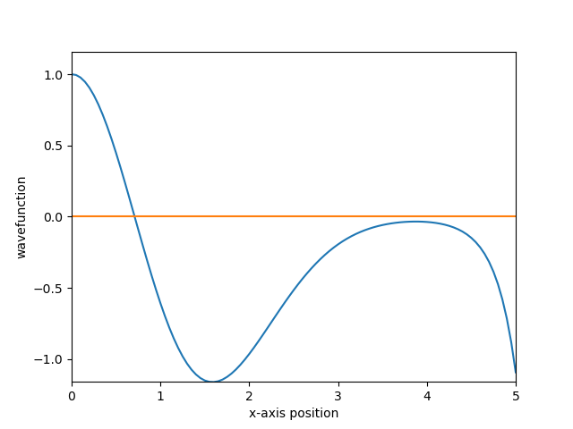

# Schrödinger Equation Solver (RK4 Method)


This project numerically solves the one-dimensional time-independent Schrödinger equation using the fourth-order Runge–Kutta (RK4) method.  
The potential used is the harmonic oscillator: $V(x) = \tfrac{1}{2}x^2$.

---

## ✨ Features

- Solves the Schrödinger equation  
  $-\tfrac{1}{2}\psi''(x) + V(x)\psi(x) = E\psi(x)$
- Uses harmonic oscillator potential $V(x) = \tfrac{1}{2}x^2$
- RK4 numerical integration
- Supports even and odd parity
- Plots the resulting wavefunction

---

## 📁 File Description

### `main.py`
Includes:
- Potential function  
- RK4 integrator  
- Boundary conditions  
- Plotting routine  

---

## 🧠 Theory Overview

The Schrödinger equation  

$-\tfrac{1}{2}\psi''(x) + V(x)\psi(x) = E\psi(x)$  

is rewritten as a first-order system by defining  

$\phi = \psi$, $\quad \phi' = \psi'$.

This gives:

- $\phi' = \phi'$
- $\phi'' = -2(E - V(x))\,\phi$

The RK4 updates are:

- $\phi_{n+1} = \phi_n + \frac{h}{6}(k_1 + 2k_2 + 2k_3 + k_4)$  
- $\phi'_{n+1} = \phi'_n + \frac{h}{6}(p_1 + 2p_2 + 2p_3 + p_4)$

Energy eigenvalues of the harmonic oscillator occur at:

$E_n = n + \tfrac{1}{2}$.

---

## 🚀 How to Run

### 1. Install requirements
pip install numpy matplotlib
### 2. Run the script
python main.py

---

## ⚙️ Parameters

Function:

```python
rk4(xmax, N, E, p)


